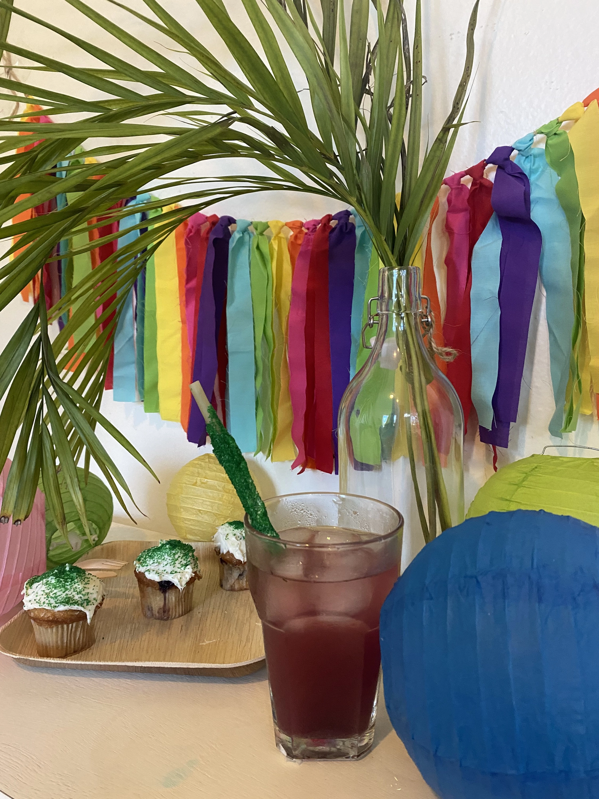

Every once in a while we hear from someone who loves our straws, and it absolutely makes our day! Recently, we heard from Sari Sime, a happy customer who is also a reseller through her business D’Light Events.

We loved her enthusiasm for our product, and would like to share her thoughts and experience with you. And as a bonus, you’ll find a quick guide to prettify your edible rice straws before a party, so they look as gorgeous as everything else!

## Sari’s Flewid Friendly experience

Sari was super happy with our straws. When asked about her experience, she said: “I absolutely love the straws. I feel like they are better than paper straws, they last longer, and they are much more comfortable to drink with than paper straws.”

We know the feeling, Sari! Our edible rice straws are strong – and by that we mean pretty darn strong. Think metal straws, minus the cold, uncomfortable feel of metal. You feel like you have something solid and teeth-friendly in your mouth, which you’ll find is a much better experience than trying to drink from a paper (or even plastic) straw. They’re bendy and your teeth can flatten them, which is a major drawback once you’ve had a taste of the edible straw life!

We asked Sari what she liked most about our straws, and she had this to say: “I love the fact that they are edible. Sometimes I take a bite after I have used the straw! I also love that they are much more environmentally friendly than, for example, paper straws. I’m a fan of decorating beverages and food with edible decorations, and this straw falls directly in that category because you can actually eat it!”

You can eat the straws directly after your drink, if it was hot enough, but don’t worry – chances are it won’t be cooked unless your drink is really, really hot, so the straw won’t be going soggy anytime soon (unlike some other straws). Typically, you’ll have to either boil the straws separately, or toss them into your next meal, to add a dash of noodles to whatever you’re cooking.

## About D’Light Events

D’Light Events is a boutique store for eco-friendly party decorations and supplies. Sari says, about the company: “We ship all over the United States; planning on expanding to Canada as well. Our products are specifically sourced to be both high quality and multifunctional to promote their reuse. All of our disposable products are non-toxic and compostable or biodegradable, having a less damaging impact on the environment than the usual products you may see at most events.”

We’re d’lighted to have you as a reseller, Sari! Our edible rice straws were made with the goal of having a minimal environmental impact, and we’re proud to partner with businesses like yours to get the word out and get closer to our goal of a plastic-free Earth.

To learn more about her business or to get in touch, visit her website, or her Instagram page.

Our product can help environmentally-aware businesses like hers provide eco-friendly products to their customers at affordable prices. Our product is super affordable, so you don’t feel bad about throwing it away after using it. At $8.99 a pack, you don’t feel bad about using them as noodles in a pinch. However, if you want to save a couple dollars, check back in a couple days – we often have a discount code.

If you own an eco-friendly business that wants to use our straws, come get in touch! Help spread the word, and enable your customers to make a change by using the right products. Our straws are biodegradable and non-toxic, as Sari mentioned previously.

## Making your edible rice straws cuter

While our straws are great for the environment and they serve two purposes, they don’t come in cute patterns or designs, unlike paper straws. It’s a downside of using rice flour, because there isn’t much you can do with it design-wise.

So, what do you do if you’re hosting a party and want eco-friendly products, but also want your straws to look super cute? You dress them up a little bit!

Sari came up with a great way to dress up our eco-friendly pasta straws, which she shared on an Instagram post. You can check it out here. Basically, you put some cupcake frosting around the straw, and then dip it in colored sprinkles – of whichever color you’d prefer. It’s as simple as that!

It takes a minute, and your straws now look as cute as the rest of your party décor. In fact, we might go as far as to say that these straws might be an attention-grabber, being as awesome-looking as they are!
**__**

## About our edible rice straws

Our pasta straws are made with rice flour and cassava flour, and are 100% eco-friendly and ocean-safe. They will never harm a marine animal, because being biodegradable, they’ll turn soggy and then decompose long before they get close to our marine creatures.

Each straw is 10 inches long, making it the perfect length for most drinks. It stays intact for a while even in hot drinks – you can expect it to last at least 10-25 minutes. Remember that while the straw’s getting soggy, your drink will also be cooling down! In cold drinks, it can last for over an hour without an issue.

These straws are unflavored – that means literally, they have no flavor at all, even in water. So you don’t have to worry about them changing the taste of your drink, like sugar straws and some other edible straws would.

One major benefit of these straws is their edible nature. This means that if you’re outside or at a party, you don’t have to worry about cleaning the straw and bringing it back home. You can just eat it, give it to the birds, or toss it into the waste basket. And the second benefit is that if you don’t use straws all that much and find the straws still lying in their box many months later, you can just cook them to get some use out of them!

## About Flewid Friendly

The idea for edible straws came to us while we were enjoying some spaghetti aglio e olio at our favorite Italian restaurant. The news story on television was about how we need to save our whales, and the disturbing images flashed on the screen instilled us with passion. We needed to do something.

As we sat there looking at the little plastic stir sticks in our gin-and-tonics, an idea struck us – we could make straws out of pasta! Not only would they work as straws, but they could do double duty as stirrers, and then be eaten as food! The idea was solid. We worked on it, and then here we are – with pasta straws that you can eat, compost, or throw away, without harming the planet in any way.

We may not be able to save the whales single handedly, and we probably can’t stop all forms of plastic pollution. However, we could (and we did) come up with a better alternative to plastic straws and stir sticks – many of which are completely useless and automatically discarded by the customer as soon as the server delivers the beverage.

## Plant a tree with each purchase!

We know that it’s important to do as much as possible, and so we’ve teamed up with Seed The Change to give our efforts a boost. Now, whenever you purchase a product from us, part of the proceeds goes to the organization to plant a tree. This will help make our Earth a greener planet, and battle the effects of air pollution and declining air quality.

The decline in air quality has become an issue of concern of late, as more and more people buy cars, and industrialization gains speed with a rise in population. Unfortunately, just about everything we humans do to survive has an adverse impact on Mother Nature. This goes from construction to leisure and even business.

Add rapid deforestation to the mix, and you’ve got a perfect recipe for disaster.

So, to combat this problem and to reverse the effects of climate change, we need to plant more trees. Planting more trees won’t make the problem magically disappear, but it’ll chip away at it, and it’ll make a sizable dent – like we said earlier. So, do what you can as an individual – whether that means growing plants at home, planting trees on your property, educating others about the effects of deforestation, helping local organizations, or buying edible rice straws.

If you’d like to learn more about Seed The Change and why they do what they do, visit their website by clicking this link.
